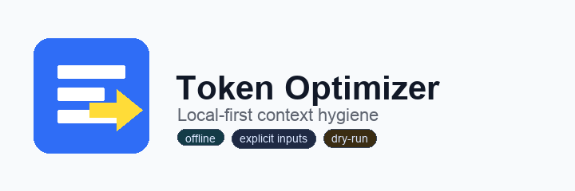
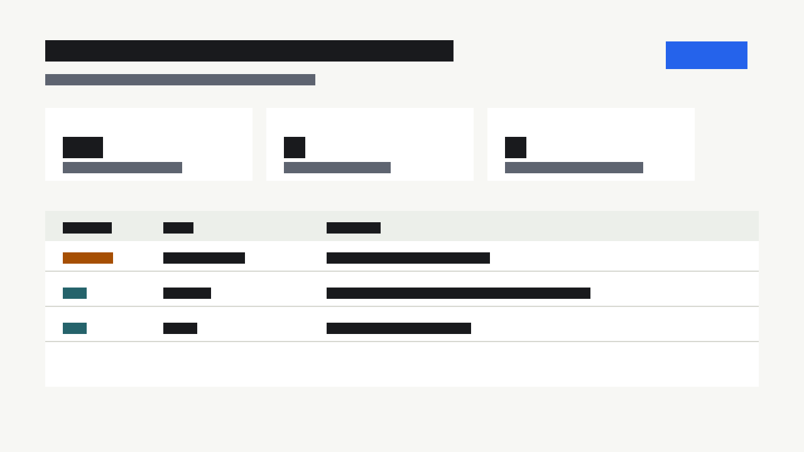
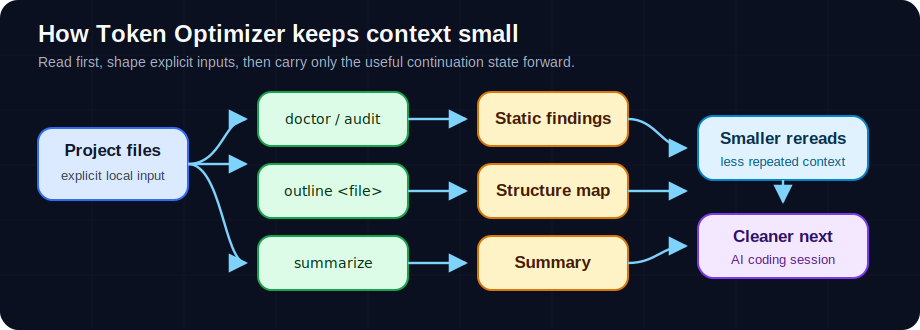
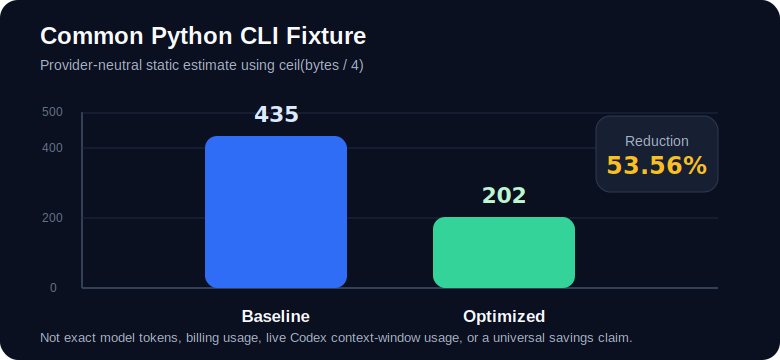
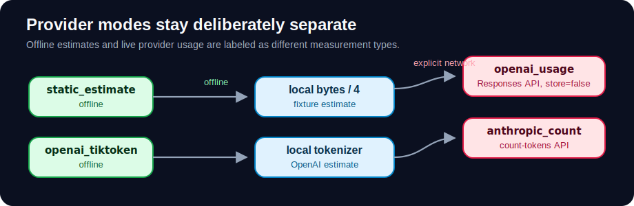

<h1 align="center">Token Optimizer</h1>

<p align="center">
  
</p>

<p align="center">
  <strong>Local-first context hygiene for AI coding sessions.</strong>
</p>

<p align="center">
  <kbd>no default network</kbd>
  <kbd>no daemon</kbd>
  <kbd>dry-run first</kbd>
  <kbd>explicit inputs</kbd>
  <kbd>Apache-2.0</kbd>
</p>

<p align="center">
  Token Optimizer helps you inspect context bloat, summarize explicit files,
  generate lightweight handoffs, and benchmark context-shaping workflows without
  installing invasive global hooks or collecting sensitive session data by
  default.
</p>

<h2 align="center">Reading Map</h2>

<table align="center">
  <thead>
    <tr>
      <th>Start Here</th>
      <th>Then Check</th>
      <th>Deep Dive</th>
    </tr>
  </thead>
  <tbody>
    <tr>
      <td><a href="#quick-start">Quick Start</a></td>
      <td><a href="#benchmark-snapshot">Benchmark Snapshot</a></td>
      <td><a href="#command-reference">Command Reference</a></td>
    </tr>
    <tr>
      <td><a href="#what-it-does">What It Does</a></td>
      <td><a href="#safety-model">Safety Model</a></td>
      <td><a href="#release-checks">Release Checks</a></td>
    </tr>
    <tr>
      <td><a href="#how-it-works">How It Works</a></td>
      <td><a href="#provider-modes">Provider Modes</a></td>
      <td><a href="#more-docs">More Docs</a></td>
    </tr>
  </tbody>
</table>

<table align="center">
  <tbody>
    <tr><th>Package</th><td><code>token-optimizer</code></td></tr>
    <tr><th>CLI</th><td><code>token-optimizer</code></td></tr>
    <tr><th>Version</th><td><code>0.1.0</code></td></tr>
    <tr><th>License</th><td>Apache-2.0</td></tr>
    <tr><th>Default network calls</th><td>none</td></tr>
    <tr><th>Default daemon/background process</th><td>none</td></tr>
    <tr><th>Default raw transcript capture</th><td>none</td></tr>
    <tr><th>Default raw file/tool-output persistence</th><td>none</td></tr>
    <tr><th>Mutating commands</th><td>require explicit <code>--yes</code></td></tr>
  </tbody>
</table>

<h2 align="center">Why It Exists</h2>

<p align="center">
  AI coding sessions get expensive and fuzzy when every handoff starts by
  rereading the same files, pasting noisy command output, and rediscovering
  decisions that should have been compacted. Token Optimizer aims to make that
  hygiene visible and repeatable.
</p>

<p align="center">
  It is not a magic token counter or an always-on recorder. The MVP is
  deliberately small: inspect, outline, summarize, benchmark explicit fixtures,
  and write only project-local Token Optimizer state when asked.
</p>

> [!NOTE]
> Token Optimizer is built for context hygiene, not hidden automation. The
> fastest path through the tool is still explicit: inspect first, choose inputs,
> then write only when you pass `--yes`.

<h2 align="center">What It Does</h2>

<table align="center">
  <thead>
    <tr>
      <th>Workflow</th>
      <th>Command</th>
      <th>What You Get</th>
    </tr>
  </thead>
  <tbody>
    <tr>
      <td>Inspect setup</td>
      <td><code>token-optimizer doctor</code></td>
      <td>Project-local paths, hook state, and safety warnings</td>
    </tr>
    <tr>
      <td>Find context bloat</td>
      <td><code>token-optimizer audit --project .</code></td>
      <td>Static signals for large files, noisy artifacts, guidance files, and plugin shape</td>
    </tr>
    <tr>
      <td>Generate dashboard</td>
      <td><code>token-optimizer dashboard --project . --dry-run</code></td>
      <td>A plan for a static HTML audit dashboard with Expert mode for raw JSON</td>
    </tr>
    <tr>
      <td>Outline files</td>
      <td><code>token-optimizer outline &lt;file&gt;</code></td>
      <td>A structure map before rereading a large Markdown or Python file</td>
    </tr>
    <tr>
      <td>Summarize files</td>
      <td><code>token-optimizer summarize &lt;files...&gt;</code></td>
      <td>A compact continuation summary from explicit inputs</td>
    </tr>
    <tr>
      <td>Benchmark fixture</td>
      <td><code>token-optimizer benchmark --fixture &lt;path&gt;</code></td>
      <td>Provider-neutral <code>static_estimate</code> comparison</td>
    </tr>
    <tr>
      <td>Initialize state</td>
      <td><code>token-optimizer config init --project . --dry-run</code></td>
      <td>Project-local config/data plan</td>
    </tr>
    <tr>
      <td>Clean up</td>
      <td><code>token-optimizer purge --project . --dry-run</code></td>
      <td>Token Optimizer-owned cleanup plan</td>
    </tr>
    <tr>
      <td>Manage hooks</td>
      <td><code>token-optimizer hooks install --project . --dry-run</code></td>
      <td>Advanced experimental Stop-hook plan</td>
    </tr>
    <tr>
      <td>Hook MCP control</td>
      <td>Token Optimizer plugin hook control</td>
      <td>Interactive MCP control with native approval-form fallback for the experimental no-op Stop-hook entry</td>
    </tr>
  </tbody>
</table>

<p align="center">
  
</p>

<h2 align="center">Quick Start</h2>

<p align="center"><strong>From a source checkout:</strong></p>

```bash
PYTHONPATH=src python3 -m token_optimizer.cli doctor
PYTHONPATH=src python3 -m token_optimizer.cli audit --project .
PYTHONPATH=src python3 -m token_optimizer.cli outline README.md
PYTHONPATH=src python3 -m token_optimizer.cli summarize README.md SECURITY.md
PYTHONPATH=src python3 -m token_optimizer.cli benchmark --fixture benchmarks/fixtures/common-python-cli-session
```

<p align="center"><strong>Installed as a package:</strong></p>

```bash
token-optimizer doctor
token-optimizer audit --project .
token-optimizer outline README.md
token-optimizer summarize README.md SECURITY.md
```

<h2 align="center">How It Works</h2>

<p align="center">
  
</p>

<table align="center">
  <tbody>
    <tr><td>1</td><td>Start with read-only inspection.</td></tr>
    <tr><td>2</td><td>Require explicit project paths or explicit input files.</td></tr>
    <tr><td>3</td><td>Keep default workflows local-only.</td></tr>
    <tr><td>4</td><td>Make mutating actions dry-run inspectable.</td></tr>
    <tr><td>5</td><td>Store only Token Optimizer-owned project-local files when asked.</td></tr>
    <tr><td>6</td><td>Keep provider-specific token numbers separate from static estimates.</td></tr>
  </tbody>
</table>

<h2 align="center">Benchmark Snapshot</h2>

<p align="center">
  The checked-in fixture models a small Python CLI coding session with baseline
  context files and optimized outline/summary outputs.
</p>

> [!IMPORTANT]
> The chart below is a provider-neutral fixture result. It is not exact model
> tokens, billing usage, live Codex context-window usage, or a universal savings
> claim.

<p align="center">
  
</p>

<table align="center">
  <tbody>
    <tr><th>Baseline estimate</th><td align="right">435</td></tr>
    <tr><th>Optimized estimate</th><td align="right">202</td></tr>
    <tr><th>Reduction</th><td align="right">233</td></tr>
    <tr><th>Reduction percent</th><td align="right">53.56%</td></tr>
    <tr><th>Preservation checks</th><td align="right">all pass</td></tr>
  </tbody>
</table>

<table align="center">
  <thead>
    <tr>
      <th>Side</th>
      <th>File</th>
      <th>Bytes</th>
      <th>Static Estimate</th>
    </tr>
  </thead>
  <tbody>
    <tr><td>Baseline</td><td><code>baseline/cli.py</code></td><td align="right">328</td><td align="right">82</td></tr>
    <tr><td>Baseline</td><td><code>baseline/continuation-note.md</code></td><td align="right">255</td><td align="right">64</td></tr>
    <tr><td>Baseline</td><td><code>baseline/error-output.txt</code></td><td align="right">236</td><td align="right">59</td></tr>
    <tr><td>Baseline</td><td><code>baseline/readme.md</code></td><td align="right">332</td><td align="right">83</td></tr>
    <tr><td>Baseline</td><td><code>baseline/security-model.md</code></td><td align="right">277</td><td align="right">70</td></tr>
    <tr><td>Baseline</td><td><code>baseline/test-output.txt</code></td><td align="right">307</td><td align="right">77</td></tr>
    <tr><td>Optimized</td><td><code>optimized/outline-output.txt</code></td><td align="right">134</td><td align="right">34</td></tr>
    <tr><td>Optimized</td><td><code>optimized/summary-output.txt</code></td><td align="right">672</td><td align="right">168</td></tr>
  </tbody>
</table>

<p align="center">
  These numbers are provider-neutral <code>static_estimate</code> values using
  <code>ceil(bytes / 4)</code>. They are useful for checking the fixture and
  methodology. They are not exact model tokens, not billing numbers, not live
  Codex context-window usage, and not a universal savings claim.
</p>

<h2 align="center">Use It When</h2>

<table align="center">
  <thead>
    <tr>
      <th>Situation</th>
      <th>Why It Helps</th>
    </tr>
  </thead>
  <tbody>
    <tr><td>A session keeps rereading setup files</td><td><code>outline</code> and <code>summarize</code> make the next read smaller and more deliberate</td></tr>
    <tr><td>Command output is drowning useful facts</td><td><code>audit</code> flags noisy artifacts before they become handoff clutter</td></tr>
    <tr><td>You want a dashboard without a service</td><td><code>dashboard --dry-run</code> and <code>--yes</code> produce static HTML only, with Expert mode for raw audit JSON</td></tr>
    <tr><td>You need benchmark discipline</td><td><code>benchmark --fixture</code> separates static estimates from provider-specific counts</td></tr>
    <tr><td>You are considering hooks</td><td><code>hooks install --dry-run</code>, the plugin hook control app, or the native fallback form shows the exact managed block before any write</td></tr>
  </tbody>
</table>

<h2 align="center">Safety Model</h2>

<table align="center">
  <thead>
    <tr>
      <th>Area</th>
      <th>Default Posture</th>
      <th>Opt-In Behavior</th>
    </tr>
  </thead>
  <tbody>
    <tr><td>Network</td><td>No default network calls</td><td>Live provider benchmarks only when explicitly invoked</td></tr>
    <tr><td>Persistence</td><td>No raw transcripts, raw file contents, or raw tool output</td><td>Project-local config/data with <code>--yes</code></td></tr>
    <tr><td>Hooks</td><td>No hook installed by plugin installation</td><td>Advanced experimental Stop-hook entry requires dry-run review plus <code>--yes --experimental</code>, hook control app approval, or explicit native-form approval; the installed command is intentionally no-op in 0.1.0</td></tr>
    <tr><td>Dashboard</td><td>No server or watcher</td><td>Static HTML file under <code>.codex/token-optimizer/</code></td></tr>
    <tr><td>Cleanup</td><td>No implicit deletes</td><td><code>purge --dry-run</code>, then <code>purge --yes</code></td></tr>
  </tbody>
</table>

<p align="center">
  Writable Token Optimizer-owned paths are constrained to the selected project.
  Dashboard output is constrained to <code>.codex/token-optimizer/</code>.
  Hook/config/purge apply paths reject symlinked parent escapes and stale plans
  before writing or removing project-owned state.
</p>

<h2 align="center">Provider Modes</h2>

<table align="center">
  <thead>
    <tr>
      <th>Mode</th>
      <th>Command</th>
      <th>Network</th>
      <th>Credential</th>
      <th>Report Label</th>
    </tr>
  </thead>
  <tbody>
    <tr><td>Static estimate</td><td><code>benchmark --fixture &lt;path&gt;</code></td><td>no</td><td>none</td><td><code>static_estimate</code></td></tr>
    <tr><td>OpenAI tokenizer</td><td><code>benchmark openai-tiktoken --fixture &lt;path&gt; --model &lt;model&gt;</code></td><td>no</td><td>none</td><td><code>openai_tokenizer_estimate</code></td></tr>
    <tr><td>OpenAI live usage</td><td><code>benchmark openai-usage --fixture &lt;path&gt; --model &lt;model&gt;</code></td><td>yes</td><td><code>OPENAI_API_KEY</code></td><td><code>openai_provider_usage</code></td></tr>
    <tr><td>Anthropic live count</td><td><code>benchmark anthropic-count --fixture &lt;path&gt; --model &lt;model&gt;</code></td><td>yes</td><td><code>ANTHROPIC_API_KEY</code></td><td><code>anthropic_count_tokens</code></td></tr>
  </tbody>
</table>

<p align="center">
  Live provider modes send only the explicit fixture text. OpenAI live usage
  sends requests with <code>store=false</code>. Provider benchmark reports are
  printed to stdout and are not persisted by Token Optimizer.
</p>

<p align="center">
  
</p>

<h2 align="center">Pros And Tradeoffs</h2>

<table align="center">
  <thead>
    <tr>
      <th>Good Fit</th>
      <th>Tradeoff</th>
    </tr>
  </thead>
  <tbody>
    <tr><td>Local-first teams that want inspectable context hygiene</td><td>It will not silently watch or optimize every session</td></tr>
    <tr><td>Repos with repeated handoff and reread overhead</td><td>You must choose explicit files or fixtures</td></tr>
    <tr><td>Users who want dry-run-first project-local changes</td><td>Mutating workflows are intentionally a little slower</td></tr>
    <tr><td>Benchmark methodology work</td><td>Static estimates are approximate by design</td></tr>
    <tr><td>Inert plugin packaging</td><td>Active hook automation is intentionally deferred/gated</td></tr>
  </tbody>
</table>

<h2 align="center">Command Reference</h2>

<details open>
<summary>Current CLI surface</summary>

<table align="center">
  <thead>
    <tr>
      <th>Command</th>
      <th>Read/Write</th>
      <th>Notes</th>
    </tr>
  </thead>
  <tbody>
    <tr><td><code>doctor</code></td><td>read</td><td>Shows setup status</td></tr>
    <tr><td><code>doctor --json</code></td><td>read</td><td>Stable JSON report</td></tr>
    <tr><td><code>audit --project .</code></td><td>read</td><td>Static context-hygiene findings</td></tr>
    <tr><td><code>audit --project . --json</code></td><td>read</td><td>Stable JSON report</td></tr>
    <tr><td><code>dashboard --project . --dry-run</code></td><td>read</td><td>Shows planned dashboard path/content</td></tr>
    <tr><td><code>dashboard --project . --yes</code></td><td>write</td><td>Writes static HTML under <code>.codex/token-optimizer/</code>; Expert mode reveals raw audit JSON</td></tr>
    <tr><td><code>outline &lt;file&gt;</code></td><td>read</td><td>Markdown and Python structure maps</td></tr>
    <tr><td><code>summarize &lt;files...&gt;</code></td><td>read</td><td>Explicit file summaries only</td></tr>
    <tr><td><code>handoff &lt;files...&gt;</code></td><td>read</td><td>Alias for <code>summarize</code></td></tr>
    <tr><td><code>summarize --git-state</code></td><td>read</td><td>Adds opt-in local git branch/status/commit context</td></tr>
    <tr><td><code>benchmark --fixture &lt;path&gt;</code></td><td>read</td><td>Provider-neutral fixture estimate</td></tr>
    <tr><td><code>benchmark --fixture &lt;path&gt; --json</code></td><td>read</td><td>Stable JSON report</td></tr>
    <tr><td><code>config init --project . --dry-run</code></td><td>read</td><td>Project-local config/data plan</td></tr>
    <tr><td><code>config init --project . --yes</code></td><td>write</td><td>Creates <code>.codex/token-optimizer.json</code> and <code>.codex/token-optimizer/</code></td></tr>
    <tr><td><code>purge --project . --dry-run</code></td><td>read</td><td>Cleanup plan</td></tr>
    <tr><td><code>purge --project . --yes</code></td><td>write</td><td>Removes Token Optimizer-owned state</td></tr>
    <tr><td><code>hooks install --project . --dry-run</code></td><td>read</td><td>Advanced experimental hook plan</td></tr>
    <tr><td><code>hooks install --project . --yes --experimental</code></td><td>write</td><td>Installs an active Stop-hook entry that invokes an intentionally no-op command</td></tr>
    <tr><td>Plugin hook control app/native fallback</td><td>write, after approval</td><td>Installs or removes only the Token Optimizer managed no-op Stop-hook entry</td></tr>
    <tr><td><code>hooks uninstall --project . --yes</code></td><td>write</td><td>Removes managed hook state</td></tr>
  </tbody>
</table>

</details>

<h2 align="center">Plugin Packages</h2>

<p align="center">
  Token Optimizer ships native package surfaces for Codex and Claude Code. The
  Codex package includes the local MCP hook-control surface. The Claude Code
  package is skill-only in 0.1.0 and guides safe CLI usage without installing
  hooks, starting MCP servers, or bundling the Python CLI binary.
</p>

<table align="center">
  <thead>
    <tr>
      <th>Surface</th>
      <th>Path</th>
      <th>Includes</th>
      <th>Does Not Include</th>
    </tr>
  </thead>
  <tbody>
    <tr><td>Codex</td><td><code>.codex-plugin/</code>, <code>marketplace/plugins/token-optimizer/</code></td><td>Skill, assets, local MCP hook-control server</td><td>Default hook install, daemon, networked service</td></tr>
    <tr><td>Claude Code</td><td><code>.claude-plugin/marketplace.json</code>, <code>plugins/token-optimizer/</code></td><td>Skill-only native Claude Code plugin</td><td>Hook install, MCP server, daemon, bundled Python CLI</td></tr>
  </tbody>
</table>

<p align="center"><strong>GitHub install shapes after the repo is public:</strong></p>

```bash
codex plugin marketplace add avikahana/token-optimizer --sparse marketplace
codex plugin add token-optimizer@token-optimizer-local

claude plugin marketplace add avikahana/token-optimizer
claude plugin install token-optimizer@token-optimizer
```

The CLI can also be installed directly from the GitHub source with a Python
installer such as `pipx`. The Claude Code plugin expects the CLI to be available
separately.

<h2 align="center">Release Checks</h2>

<details>
<summary>Validation commands and artifact boundaries</summary>

Run these before tagging or publishing artifacts:

```bash
PYTHONPATH=src PYTHONDONTWRITEBYTECODE=1 python3 -m unittest discover -s tests -q
python3 scripts/check_release_artifacts.py
PYTHONPATH=/private/tmp/token-optimizer-validator-pyyaml python3 /path/to/validate_plugin.py .
PYTHONPATH=/private/tmp/token-optimizer-validator-pyyaml python3 /path/to/validate_plugin.py marketplace/plugins/token-optimizer
claude plugin validate .
claude plugin validate ./plugins/token-optimizer
```

For local marketplace install checks, use
[`docs/local-marketplace-verification.md`](docs/local-marketplace-verification.md).

<table align="center">
  <thead>
    <tr>
      <th>Artifact</th>
      <th>Boundary</th>
    </tr>
  </thead>
  <tbody>
    <tr><td>Wheel</td><td>Installable package, metadata, entry points, license</td></tr>
    <tr><td>Source distribution</td><td>Source, tests, benchmark fixtures, release scripts, public docs</td></tr>
    <tr><td>Codex plugin package</td><td><code>.codex-plugin/</code>, <code>.mcp.json</code>, <code>mcp/</code>, <code>skills/</code>, <code>assets/</code> only</td></tr>
    <tr><td>Claude Code plugin package</td><td><code>.claude-plugin/</code>, <code>skills/</code>, and package README only</td></tr>
  </tbody>
</table>

</details>

<h2 align="center">More Docs</h2>

<p align="center">
  <a href="SECURITY.md">Security</a> ·
  <a href="PRIVACY.md">Privacy</a> ·
  <a href="TERMS.md">Terms</a> ·
  <a href="RELEASE_NOTES.md">Release Notes</a> ·
  <a href="docs/benchmarking.md">Benchmarking</a> ·
  <a href="docs/provider-benchmark-contributor-guide.md">Provider Guide</a> ·
  <a href="docs/persistence-map.md">Persistence Map</a>
</p>

<h2 align="center">Public URLs</h2>

<p align="center">
  Repository:
  <a href="https://github.com/avikahana/token-optimizer">github.com/avikahana/token-optimizer</a>
  <br>
  <a href="https://github.com/avikahana/token-optimizer/blob/main/PRIVACY.md">Privacy</a> ·
  <a href="https://github.com/avikahana/token-optimizer/blob/main/TERMS.md">Terms</a> ·
  <a href="https://github.com/avikahana/token-optimizer/blob/main/RELEASE_NOTES.md">Release Notes</a>
</p>

<h2 align="center">License</h2>

<p align="center">
  Token Optimizer is licensed under the Apache License 2.0.
</p>
